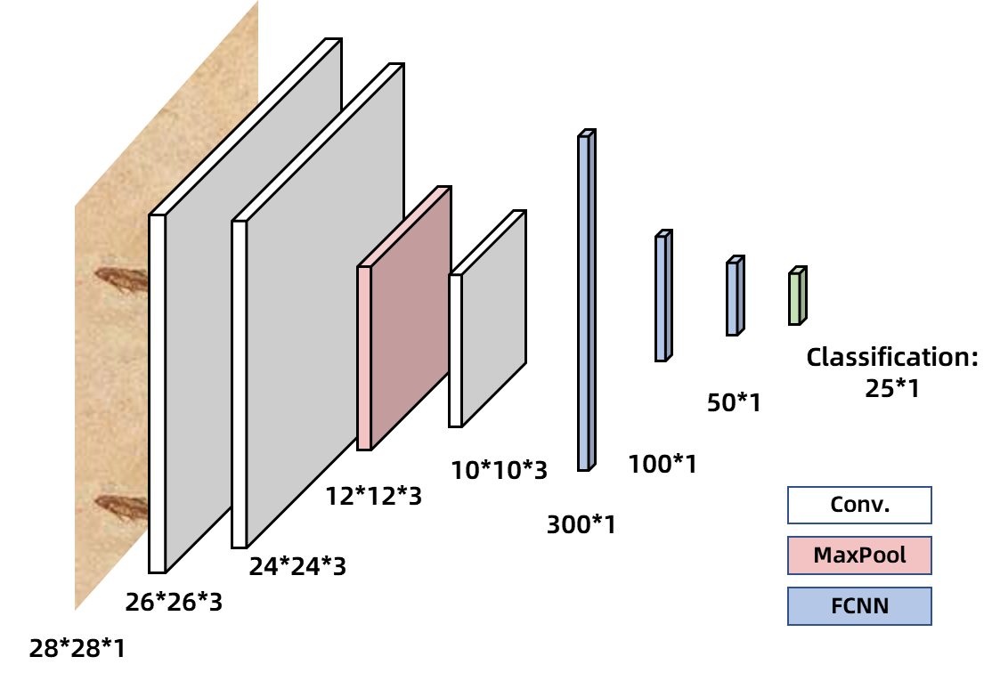
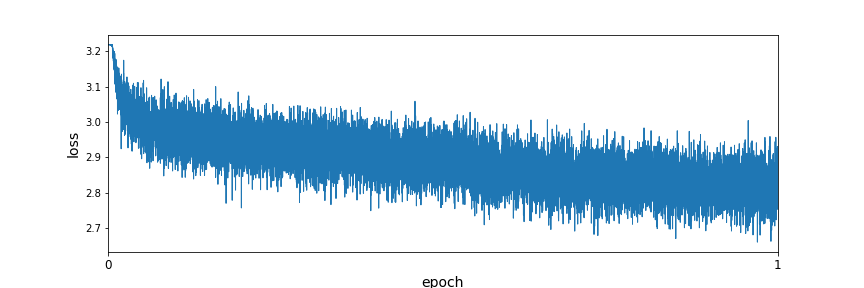
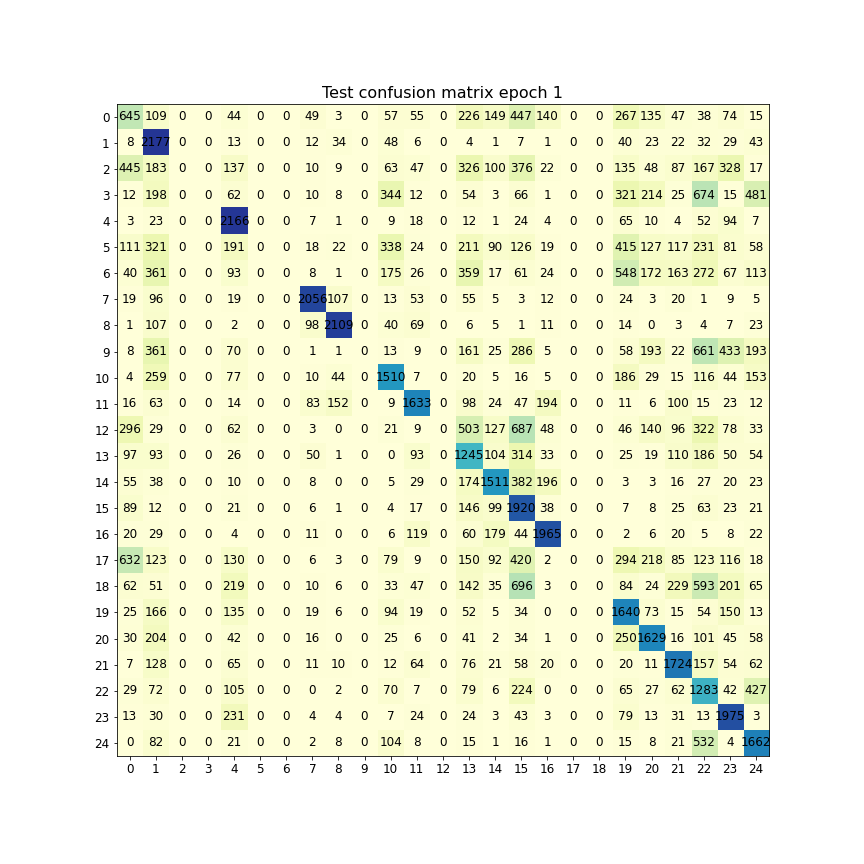
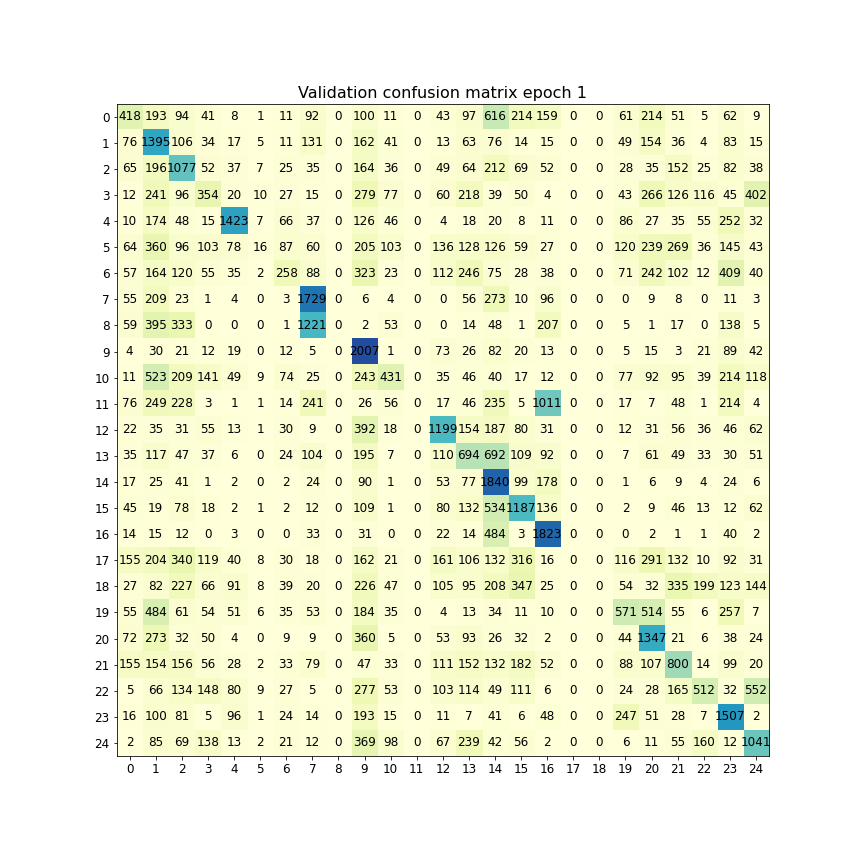
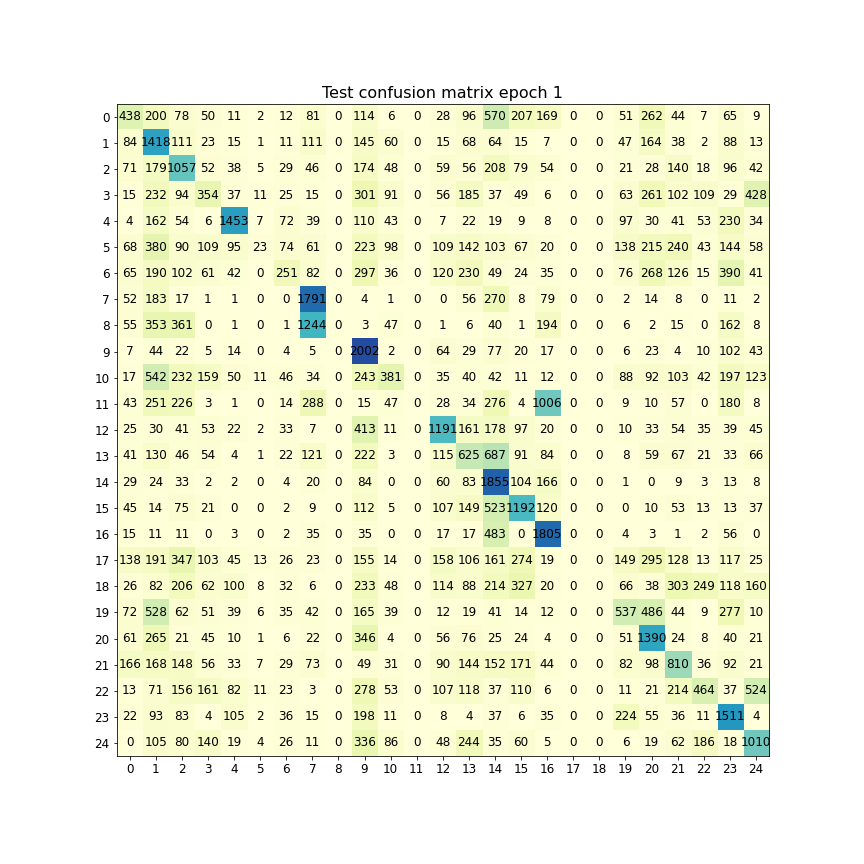

# Free-hand sketch classification problem

Bozitao Zhong    220030910014

Course project for SJTU CS420 Machine Learning

## Main Ideas

### Background

**QuickDraw** is one of the largest free-hand sketch datasets. It includes 345 categories of common objects, and each one contains 70 thousand training, 2.5 thousand validation and 2.5 thousand test samples. The dataset is available at https://magenta.tensorflow.org/sketch_rnn. 

In this project, we choose 25 categories (cow, panda, lion, tiger, raccoon, monkey, hedgehog, zebra, horse, owl, elephant, squirrel, sheep, dog, bear, kangaroo, whale, crocodile, rhinoceros, penguin, camel, flamingo, giraffe, pig, cat) from **QuickDraw** for the sketch classification problem. Each sketch individual is translated to a 28*28 sketch image as the model input.

### Transform free-hand sketch dataset into pixel image dataset

The original sketches in QuickDraw are described as vectorized sequences, which we want to further translated into sketch pixel images. 

In this project, I used some functions from **pix2seq** https://github.com/CMACH508/RPCL-pix2seq which offers an approach to create the pixel-formed sketch images to build mine dataset transform tools `data_transform.py`. Why I rebuild that code is because that code has too much setting which are too fuzzy for me, and I'm using PyTorch rather than Tensorflow.

### Baseline model

For baseline models, I selected simple fully-connected neural network (FCNN) as baseline. These models are relative simple for this complicated classification problem. (All baseline models are built with scikit-learn package)

### Deep learning model

For deep learning models, I used a CNN (convolutional neural network) model for classification. As we know, CNN models are good learners in image classification tasks, like VGG and AlexNet had achieved state-of-the-art model in ImageNet task. 

In this task, I adopted a model similar to VGG design, to use more 3*3 kernels in order to improve preformance.

## Methods and Algorithms

### FCNN model

A fully connected neural network is build for comparison. This model has 3 hidden layers with (100,100,50) nodes. In this project, I used this model as baseline

### CNN model

Our CNN model is constructed based on VGG neural network. In this model, we have 3 convolutional layers, followed by 1 maxpooling layer and 3 fully connected layers. The kernel size in convolution layer is 3*3, which is the important part in VGG. 

The model structure of CNN is shown in following figure.

Figure 1. CNN model architechture

## Experimental settings

### Dataset

Dataset has 25 classifications, each image is classified into 1 of the 25 classifications. Each pixel image is 28*28 large unless have specific setting. We transformed the dataset from svg information to png images by written script `data_transformation.py`. Due to the huge amount of data to be transformed, I used SJTU Siyuan HPC cluster for task parallelization. 

After transformation, we have a dataset with 25 classifications, each class have a training set, a test set and a validation set. Each class's training set has 70,000 28\*28 images, test set has 2,500 28\*28 images and validation set has 2,500 28*28 images.

### Training setting

In our CNN model, the learning rate is set to be 0.0005. Batch size is 100 to because it's suitable for the large dataset with 70,000*25 images. We used accuracy, F1 score, confusion matrices as metrics for prediction results. I used 10 epoch to train the CNN model. The loss function is cross entropy.

This model is trained on SJTU pi2.0 HPC clusters using NVIDIA DGX-2 V100 GPU.

## Results

After 1 epoch of training of CNN model with the full datasets, the loss has decreased with the training process (Figure 2)

Figure 2. Loss change vs epoch

Model performance is measured by tests on both validation set and test set, the confusion matrix of these sets is shown in Figure 3 and 4.

Figure 3. Validation set confusion matrix

Figure 4. Test set confusion matrix

The accuracy in validation set is 46.34%, in test set is 46.16%. F1 score in validation set is 0.3855, in test set is 0.3846.

From the confusion matrix, we can see that the model actually performed well in some of the classes, and some classes it didn't have a single image (like the 2nd, 3rd, 5h, 6th, 9th, 17th and 18th) classified into it.

| Model | Validation Accuracy | Validation F1-score | Test Accuracy | Test F1-score |
| ----- | ------------------- | ------------------- | ------------- | ------------- |
| FCNN  | 34.61%              | 0.2928              | 34.49%        | 0.2906        |
| CNN   | 46.34%              | 0.3855              | 46.16%        | 0.3846        |

Table 1. Performance of FCNN and CNN model

## Conclusion

In this project, I implemented 2 deep learning models to classify the free-handed sketch images. Though models are kind of simple, our classification accuracy is accepted for us. Comparing simple FCNN and CNN, convolutional layers are obviously better for image data than MLP. The test results is shown in Table 1. And some result of FCNN model is in Appendix.

The baseline SVM took me too much time for training, so I give up on training this model. This might because we have too much data point in this project.

In this course, I learned the principles and implementation of machine learning models, especially I did a lot of hands-on practices. The knowledge and skills I learned in this course will helped better in future research.

## Group member and contribution

My group only have one member: Bozitao Zhong (student ID: 220030910014), all work is done by me, including designing and building models, conduct experiments, writing report and visualization.

The code of this project is available at https://github.com/Zuricho/Free_Hand_Sketch

## Appendix

Figure 5. Validation set confusion matrix of FCNN model

Figure 6. Test set confusion matrix of FCNN model
